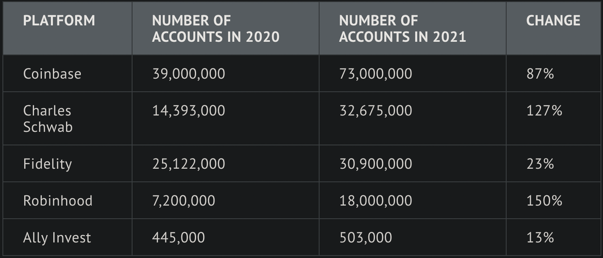
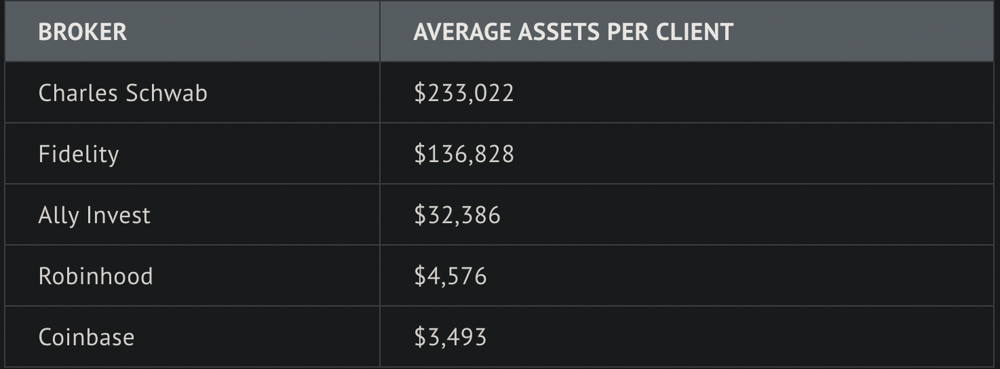

# FinTech Case Study

## Overview and Origin

* Name of the company: **`Robinhood`/`Robinhood` Markets** 

* According to the **`Robinhood` Markets Wikipedia page** here: [Robinhood Wikipedia](https://tinyurl.com/robinhood-wikipedia]), `Robinhood` was incorporated *April 18th, 2013*. And on *July 28, 2021* `Robinhood` went public with an initial public offering of **$38** per share. 

* According to the **`Robinhood` Markets Wikipedia page** here: [Robinhood Wikipedia](https://tinyurl.com/robinhood-wikipedia]), "`Robinhood` was founded in *April 2013* by **`Vladimir Tenev`** and **`Baiju Bhatt`**...". The two founders met at Stanford University, and after a brief stint working in FinTech in New York City, the pair moved back to California to start `Robinhood`. 

* According to the **`Robinhood` Our Story Page** here: [Robinhood Our Story](https://tinyurl.com/robinhood-our-story) the idea for `Robinhood` came up when: "[**`Vladimir Tenev`** and **`Baiju Bhatt`**]...realized that big Wall Street firms pay effectively nothing to trade stocks, while most Americans were charged commission for every trade. They soon decided it was more important to build products that would provide everyone with access to the financial markets, not just the wealthy. Two years after heading to New York, they moved back to California and built `Robinhood`—a company that leverages technology to encourage everyone to participate in our financial system." The way they do this is by both not charging commissions as well as having a more accessible mobile application.

* According to an article from **SeekingAlpha** and by *`Kent Thun`e*: [Robinhood Revenues](https://tinyurl.com/robinhood-revenues) `Robinhood` is funded by: 

1. ***User Transactions***
1. ***Subscriber Fees***
1. ***Stock Loans/Margin Trading***
1. ***Cash Management Fees***
1. ***Income from Cash and Fees on Transfers/other Services.*** 

* ...Beyond these sources of income, another source of income for `Robinhood` is payment-for-order-flow. And according to **Crunchbase** here: [Robinhood Crunchbase (Financials)](https://tinyurl.com/robinhood-cb-financials) "`Robinhood` has raised **$6.2 Billion** over *27 rounds* and their latest round of funding was raised on *May 13, 2022* from a ***Post-IPO Secondary round***". This makes `Robinhood` one of the largest brokerage firms in the world, corroborated by this article here: [Largest Brokerage Firms](https://tinyurl.com/largest-brokerage-firms).

## Business Activities

* According to this **CNBC** article by *`Julia Boorstin`* here: [CNBC Article](https://tinyurl.com/robinhood-disruptive) "The company has removed barriers to trading by making investing commission-free and mobile-first. It has simplified investing, and made it more accessible and personal". As previously discussed, the lack of commission fees and the mobile-first application has galvanized and broken down barriers for a customer base of mostly young and inexperienced traders.

* According to this **New York Times** article by *`Nathaniel Popper`* here: [NY Times Article](https://tinyurl.com/robinhood-customers) "`Robinhood`’s average customer is young and lacks investing know-how. The average age is 31, the company said, and half of its customers had never invested before". And according to ***`Robinhood`'s*** **Q2 2022 Results Report** here: [Robinhood Q2 Report](https://tinyurl.com/robinhood-Q2-2022) "Net Cumulative Funded Accounts were 22.9 million, an increase of 100 thousand sequentially. Monthly Active Users (MAU) decreased 1.9 million sequentially to 14.0 million for June 2022, as customers navigated the volatile market environment". Even though `Robinhood` has 22.9 millions customer accounts, their competitors like ***Charles Schwab, Fidelity Investments*** and even ***Coinbase*** have much more customers and assets according to this article on **The Ascent by Motley Fool** written by *Lyle Daly*: [Largest Brokerage Firms](https://tinyurl.com/largest-brokerage-firms).

* The somewhat unfair advantage that `Robinhood` has had from its inception is that unlike some of thier competitors such as ***Charles Schwab, Fidelity Investments, E-TRADE, and TD Ameritrade***, `Robinhood` does not charge its customers commissions. Another advantage `Robinhood` has is the fact that they allow trading through a mobile application, which many of its competitors listed above do not have. This has amde trading much more accessible and streamling for their customers that are either new to trading or can not afford to use a desktop application as well as commission fees. 

* The technologies used to implement `Robinhood`'s applications can be seen below in an image from **StackShare** linked here: [Robinhood Stackshare](https://tinyurl.com/robinhood-stackshare). Some of the major technologies include *Meta's React for Front-End development, PostgresSQL as a Database, ElasticSearch & ELK for indexed searching and logging, Docker for containerization, Jenkins automation servers, and Slack for business communication.* 

## Landscape

* According to an artcle on **Investopedia** by *`Matthew Johnston`* here: [Investopedia Robinhood](https://tinyurl.com/robinhood-investopedia) "`Robinhood` is an ***online discount brokerage*** that offers a commission-free investing and trading platform". And though many brokerages provide trading platform such as *Chales Schwab's StreetSmart Edge* platform, most are not like `Robinhood` in the fact that they provide a mobile-first platform without commission fees.

* Thre are  major trends that have disrupted the *Brokerage Firm Industry* and both have been employed by Robbinhood. The first is that `Robinhood`, unlike many older titans of the industry like Charles Schwab, is a discount brokerage and therefore charges **$0.00** to minimal ammounts of commission. The second is that with the rise of smartphones many brokerage firms, including:
 
1. **Charles Schwab**
1. **Fidelity** 
1. **E-Trade**
1. **Coinbase**
1. **Ally Invest**
1. **Vanguard**

* ...now have **mobile-first apps** (*pictured below*). This has allowed for anyone with a smartphone to participate in trading, opening up doors to many first-time traders. 

  

* According to this article from **The Ascent by Motley Fool** written by *`Lyle Daly`*: [Largest Brokerage Firms](https://tinyurl.com/largest-brokerage-firms) some of `Robinhood`s major competitors include ***Charles Schwab, Fidelity, Bank of America/Merrill Lynch,, Ally Invest, Vanguard and ***. 

1. ***Charles Schwab*** 
1. ***Fidelity*** 
1. ***E-Trade***
1. ***Coinbase***
1. ***Ally Invest***
1. ***Bank of America/Merrill Lynch***
1. ***Coinbase***
1. ***Vanguard***
1. ***J.P. Morgan***

* ...The article goes on to list the **AUM, number of accounts, and average assets per client** metrics, which make `Robinhood` one of the largest brokerage firms.

## Results

* The two largest business impacts of `Robinhood` are that competitors like *Fidelity, E-Trade and Merill Lynch* are now all offering trades with no commission to compete with the likes of `Robinhood` and other discount brokerages of the like. This is a trend which `Robinhood` itself and new competitors popping up, like Webull, which uses the same discount brokerage's trend by also not charging commission. Both the older competitors and new competitors can be seen in this article on **Nerd Wallet** by *`Chris Davis`* here: [Discount Brokerage Firms](https://tinyurl.com/db-firms) as well as in the table below. Beyond this another major trend started by `Robinhood` is being **mobile-first**, as competitors like:

1. **Charles Schwab**
1. **Fidelity** 
1. **E-Trade**
1. **Coinbase**
1. **Ally Invest**
1. **Vanguard**

* ...have all come out with their own *mobile applications* so as to compete with `Robinhood's` *mobile-first* application, some of which are pictured below.

   

* Three core metrics for both Brokerage Firms and `Robinhood` are assets under managment aka AUM, number of accounts on the platform aka number of clients and finally average assets per client. With these metrics we can see that `Robinhood` has ***$0.19 Trillion AUM***, *7.2* ***Million*** accounts and the average assets per client is ***$4,576***. This is according to this article from **The Ascent by Motley Fool** written by *`Lyle Daly`*: [Largest Brokerage Firms](https://tinyurl.com/largest-brokerage-firms) and illustrated by the tables below that come from the same article. 

* `Robinhood` has more AUM than *Coinbase and Ally Invest* but less AUM than *Charles Schwab, Fidelity and Bank of America/Merrill Lynch*. This puts `Robinhood` in 5th place under **AUM**. `Robinhood` also has more accounts than *Ally Invest* but less than *Coinbase, Charles Schwab and Fidelity* putting them in 4th place under **accounts**. And `Robinhood`'s *average assets per client* is greater than that of *Coinbase* but less than that of *Charles Schwab, Fidelity and Ally Invest*, once again putting `Robinhood` in 4th place. This is according to this article from **The Ascent by Motley Fool** written by *`Lyle Daly`*: [Largest Brokerage Firms](https://tinyurl.com/largest-brokerage-firms) and illustrated by the tables below that come from the same article.

## Recommendations

* If I were to advise `Robinhood`, I would suggest they offer a *real-time news and research* platform similar to that of the **Bloomberg Terminal**. I would also advise `Robinhood` to develop a *creator-based learning platform* similar to that of **Udemy, edX and Coursera** to allow for first time inverstors to gain more business savvy within the trading ecosystem.

* I believe these two platforms would help `Robinhood` with *user engagement, user retention* and ultimately allow for their customers to become more *well educated and masterful* with their trading abilities, which in turn should again help with *user engagement and retention*.

* To achieve these new platforms/features I would suggest that `Robinhood` use *Tensorflow and Keras* to build *reccurent neural networks* (**RNN**) that customize and forecast what the user may want to learn. This article on **Towards Data Science** written by *`Mohit Mayank`* illustrates why *Keras* (*now the default api for Tensorflow*) is great for developing a streamlined **RNN** with an **LSTM layer** [RNN/LSTM Keras](https://tinyurl.com/tds-keras) I would also use the **Socket.io** library in conjunction with the **React** front-end to allow for classical *pub/sub* or **API's** from different news organizations as discussed here [Socket.io Stackoverflow](https://tinyurl.com/socket-io-stackoverflow), in conjunction with the **ElasticSearch's** indexing as discussed here [ElasticSearch Indexing](https://tinyurl.com/elasticsearch-indexing) to give customers near real-time news updates based on their search queries.

* I would reccomend **Tensorflow and Keras** to develop a **RNN** with an *LSTM layer*, as **Tensorflow and Keras** streamline the process of developing an **RNN** with thier built-in faculties, for example the layer, *LSTM*, from **Keras**. With this **RNN** developed using **Tensorflow and Keras**, one is able to forecast and predict what the end user would like to learn. I would also reccomend the *Socket.io* node library, which works well within the `.jsx` ecosystem of the current *React* platform, as it both integrates with the existing codebase and furthermore allows for realtime **Ajax** *pub/sub* which is great for updating news in real time. This is best illustrated in this *Stackoverflow* post, that details broadcasting speeds for *Socket.io* [Socket.io Stackoverflow](https://tinyurl.com/socket-io-stackoverflow). And *ElasticSearch indexing*, as discussed here [ElasticSearch Indexing](https://tinyurl.com/elasticsearch-indexing), will help with searches by indexing queries for much better search performance. Beyond this some *API's* from news organizations, when integrated with the app, may help as well in terms of streamlining near real-time data transfers for the news feature.
